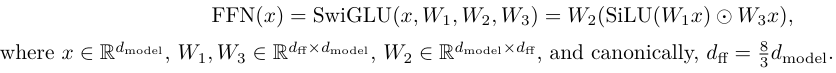

# 作业笔记
## 2.1 Unicode标准
Unicode是一个映射字符与整数的文本编码标准。单个字符与整数的转换可以使用ord和chr函数。
ord: 将一个Unicode字符表达转为整数表达
chr：将一个Unicode整数表达转为字符表达
```
(a) What Unicode character does chr(0) return?
'\x00'空字符null
(b) How does this character’s string representation (__repr__()) differ from its printed representation?
__repr__()返回的明确、丰富给调试用的字符串，print使用__str__(),返回显示友好的给用户的字符串。
(c) What happens when this character occurs in text? It may be helpful to play around with the
following in your Python interpreter and see if it matches your expectations:
直接输出chr(0)文本，调用__repr__()，返回\x00；打印输出调用__str__()，不显示任何内容
```
## 2.2 Unicode 编码
Unicode 编码将一个字符转换为字节序列，Unicode标准定义了三种编码方式，UTF-8 UTF-16 UTF-32。
Unicode标准解决了字符与数字的映射关系,如'中'与20013，Unicode编码解决了数字与字节的映射关系，如20013与b'\xe4\xb8\xad'

str经过encode转为字节流，通过decode，字节流转为str
```
>>> test_string = "hello! こんにちは!"
>>> utf8_encoded = test_string.encode("utf-8")
>>> print(utf8_encoded)
b'hello! \xe3\x81\x93\xe3\x82\x93\xe3\x81\xab\xe3\x81\xa1\xe3\x81\xaf!'
>>> print(type(utf8_encoded))
<class 'bytes'>
>>> # Get the byte values for the encoded string (integers from 0 to 255).
>>> list(utf8_encoded)
[104, 101, 108, 108, 111, 33, 32, 227, 129, 147, 227, 130, 147, 227, 129, 171, 227, 129,
161, 227, 129, 175, 33]
>>> # One byte does not necessarily correspond to one Unicode character!
>>> print(len(test_string))
13
>>> print(len(utf8_encoded))
23
>>> print(utf8_encoded.decode("utf-8"))
hello! こんにちは!
```

```
(a) What are some reasons to prefer training our tokenizer on UTF-8 encoded bytes, rather than
UTF-16 or UTF-32? It may be helpful to compare the output of these encodings for various
input strings
因为utf-8应用广泛，网络上的字符大多是utf-8编码
(b) Consider the following (incorrect) function, which is intended to decode a UTF-8 byte string into a Unicode string. Why is this function incorrect? Provide an example of an input byte string that yields incorrect results.
'中文'。原因是对于多个字节表示的单个字符，函数没有对字节序列进行切分。
(c) Give a two byte sequence that does not decode to any Unicode character(s).
b'\xe4\xe4',双字节字符第一个字节 (Lead Byte) 必须以 110 开头。第二个字节 (Continuation Byte) 必须以 10 开头。
```
```
utf-8编码
对于单字节字符：第一个比特位是 0。
对于多字节字符：
领头字节 (Lead Byte)：开头的比特位决定了整个序列的字节数。n 个 1 后面跟一个 0，表示这是一个 n 字节的字符。
延续字节 (Continuation Bytes)：所有后续字节都必须以 10 开头。
单字节序列：0xxxxxxx 双字节序列：110xxxxx 10yyyyyy 三字节序列：1110xxxx 10yyyyyy 10zzzzzz  四字节序列：11110xxx 10yyyyyy 10zzzzzz 10wwwwww
```
## 2.3 Subword Tokenization
word-level的tokenizer有超出词汇表的问题，会有没见过的词出现；byte-level的tokenizer表示一个句子token的数量是word-level的几倍，每个字符都是一个token，需要的算力非常大，也限制的上下文的长度。
subword tokenizer是word-level和byte-level的中和版，按照频率创建高频词库，将词分为子词，既基本解决了超出词汇表的问题，也不用每个字符都是一个token。
通过BPE算法创建词库的subword tokenizer通常叫做BPE tokenizer。
Tokenizers convert between strings and sequences of integers (tokens)
Tokenizer: strings <-> tokens (indices)
## 2.4 BPE Tokenizer Training
**参考内容**
> https://stanford-cs336.github.io/spring2025-lectures/?trace=var/traces/lecture_01.json

BPE Tokenizer的训练分为三个步骤：初始化词库、预标记、合并
目标：接口一致 训练TinyStories在两分钟以内
#### BPE
> 阅读论文 https://arxiv.org/abs/1508.07909
>
> 论文源码：https://github.com/rsennrich/subword-nmt
## 2.5 Experimenting with BPE Tokenizer Training
**过程**
```
句子被分为很多段，字符库无法更新 vocab_size 无法终止
    统计单词数量
原始：2m:17.679 
统计词频-只改修改的内容：1m:14.360
使用多线程耗时按线程数成倍增长
vaild数据集：统计token频率耗时:2.5n秒 使用多进程：0.57
多进程耗时34s

单元测试
无法通过推理结果测试
    使用词频统计相邻字节的频率破坏了原有的顺序，词与词之间的连接是不应该统计的
    两种思路：参考授课课件示例代码，分别统计分隔符之间的内容，计算相邻字节频率；2 参考作业1文档，分割为子词，统计每个子词中的字节对的频率
    当前：统计了词频，词列表拼接，统计相邻字节频率；
    第一种思路直观准确，但计算量大，每次统计相邻字节频率需要遍历整个文件内容；第二种无需遍历整个文档，但词与词之间的字节对是缺失的；
    先实现第二种
    实现后，merge结果与单元测试对不上，但是统计生成的merge的结果发现频率是由高到低出现的，反而参考结果不是
        原因为：不要忘记新的token出现，在新token的前后，与原token的组合是减少的，如they，h和e组成新的he，t h的数量是减少的，e y的数量也是减少的
    merge结果与单元测试对不上，对不上的大多是前后两个元素的顺序不对
        原因为：max函数直接返回了第一个出现的最高频率元素，没有考虑多个元素频率相等的情况
            当存在多个最高频率元素时，需要比较元素的key的大小（注意是字节流的，整型的token需要用vocab转换回b'...'），取大的
```
**测试**
```
uv run pytest tests/test_train_bpe.py
前两个测试通过，最后一个测试未通过；最后一个测试有少量结构不同，暂未知原因
```
在TinyStories dataset上训练耗时6m38s

## 3.4 Basic Building Blocks: Linear and Embedding Modules
### Linear
- 线性层：实现了y=xW-t的操作，其中x y为行向量，W的大小为out_feature x in_feature，与线代的W大小保持一致；线性代数中y=Wx，xy为列向量。
- 权重初始化：参数使用随机的截断正态分布进行初始化，nn.init.trunc_normal_

- nn.Parameter是torch.Tensor子类，有一些特殊属性，比如默认梯度跟踪、参数能被一些函数识别，模型中需要训练用Parameter
- torch.matmul矩阵乘法 等价于@
- torch.empty创建空张量
### Embedding
- 嵌入层：实现了token到特征向量的转换，转换方式为查表，输入token，查找表为在vocab size x 特征向量维度的表中，查找第token个特征向量
- torch.reshape()将张量变形，比如reshape(-1)变为一维、reshape(4，12，1)
- torch.index_select 选择张量中的某些元素
- self.weights[token_ids]等价于self.weights.index_select(0,token_ids.reshape(-1)).reshape(*token_ids.shape, self.embedding_dim)
## 3.5 Pre-Norm Transformer Block
### RMSNorm
- 原始transformer使用post-norm，即归一化在残差MLP或多头注意力的后面，后续工作发现pre-norm提升了模型训练的稳定性，被现代模型作为标准采用，pre-norm即把归一化放在每一层的输入上，在所有block的后面再加一个归一化


> Toan Q. Nguyen and Julian Salazar. Transformers without tears: Improving the normalization of self-attention. 2019    
> Ruibin Xiong, Yunchang Yang, Di He, Kai Zheng, Shuxin Zheng, Chen Xing, Huishuai Zhang, Yanyan Lan,
Liwei Wang, and Tie-Yan Liu. On layer normalization in the Transformer architecture.2020
- 原始transformer使用layer normalization，参考2023年Llama的工作，使用RMS norm(Root mean square layer normalization)
> Jimmy Lei Ba, Jamie Ryan Kiros, and Geoffrey E. Hinton. Layer normalization, 2016.    
> Hugo Touvron, Thibaut Lavril, ..., Llama: Open and efficient foundation language models, 2023.    
> Biao Zhang and Rico Sennrich. Root mean square layer normalization.2019

### Position-Wise Feed-Forward Network
- 原始transformer的前馈层用relu作为激活函数放在两个线性变换的中间
- 现代模型如llama3 qwen2.5使用了SwiGLU作为激活函数，SwiGLU结合了SiLU和GLU
- 参考PaLM 2022和LLaMA 2023，忽略线性层的偏置

| SiLU | GLU |
| --- | --- |
|  |  |
FFN 


### Relative Positional Embeddings
- 作用：对输入向量进行旋转，每两个元素看作为一个点坐标，旋转对应角度
- 旋转矩阵推导：
```
    x=rcos(a1),y=rsin(a1);
    x'=rcos(a1+t1)=r(cos(a1)cos(t1)-sin(a1)sin(t1))=xcos(t1)-ysin(t1)
    y'=rsin(a1+t1)=r(sin(a1)cos(t1)+cos(a1)sin(t1))=ycos(t1)+xsin(t1)
```
- 计算方法：输入batch, seq_len, d_k的输入，RoPE对seq_len维的每一个i[0,seq_len)，d_k维的每一个k[0,d_k,step=2),构建旋转矩阵Rik，然后 Rik * d_k维k对应的两个元素。
- 旋转矩阵的构建方法如下：    


### Scaled Dot-Product Attention
- softmax:输入实数向量，输出每个元素的概率，所有元素概率和为1；为什么使用e^x计算概率分布，而不是直接计算或用x^2的其他函数，1 输出为正数，输入正负都可以 2 函数单调 3 容易求导


## 3.6 The Full Transformer LM
1. 参数量：2,127,057,600   单精度需要的存储空间为：7.92 Gb
vocab_size x d_model + num_layers(2 x d_model + 4 x d_model x d_model + 3 x d_model x d_ff) + d_model + vocab_size x d_model
2. 计算方法如下，正确性未知；d_model比较大时Linear计算量多，seq_len大时，scaled_dot_product_attention计算量大
```
TransformerLM   
    TransformerBlock    
        MultiHeadAttenRoPE:
            RoPE:batch*seq_len*d_k/2*6
                =batch*seq_len*d_model/num_heads*3*2
            Linear:batch*seq_len*2*in_feature*out_feature
                =batch*seq_len*2*d_model*d_model*4  
            scaled_dot_product_attention:Q*K*V
                =batch*seq_len*seq_len*2*d_model/num_heads+batch*seq_len*d_model/num_heads*2*seq_len
                =4*batch*seq_len*seq_len*d_model/num_heads
        RMSNorm:batch*seq_len*3*d_model*2
        FFNSwiGLU:batch*seq_len*2*d_model*d_ff*3
    RMSNorm:batch*seq_len*3*d_model
    Linear:batch*seq_len*2*d_model*vocab_size
```
    
## 4.1 Cross-entropy loss
- 公式：loss = ∑-P_tar[i]*log(P_pred[i]) 
- 单目标公式：对于单目标而言，tar向量只有一个位置是1，其他均为0，公式变为-log(P_pred[i])
- 实际实现：
    1 P_pred通过softmax计算，即-log(e^pred[i]/(∑ e^pred[i]))
    2 为防止e^pred[i]超上界，pred[i]都会减去最大值，变为 <=0 的数
    3 公式简化：-log(e^pred[t]/(∑ e^pred[i])) = log(∑ e^pred[i]) - pred[t]
    4 为防止e^pred[i]超下界后，计算均值为-inf，计算均值时，只计算结果不为-inf的数据
- 总是数值出范围：原因是torch.max求取了全局最大值而不是每个batch的最大值

## 6 Generating text
- Temperature（温度系数）参与运算的方式：

- 含义：温度系数的理论范围是(0, inf)，主流工业标准范围是[0,2]，当 t < 1 时，除以t会放大候选分数之间的差距（e^x函数的梯度变化是x越大梯度越大，越小梯度越小），高分更高，低分更低，模型变得更确定，倾向于选择最高概率词，减少随机性。
当 t > 1 时，除以t会缩小候选分数之间的差距，数值趋于平缓，模型变得更多样、更具创造力，非最高概率词获得更多被选中的机会。

### 代码要求
1 用户输入提示词，生成提示词直到遇到<|endoftext|>
    模型生成接入tokenizer
2 允许控制最大生成数量
3 能够进行温度控制
4 能够top-p采样